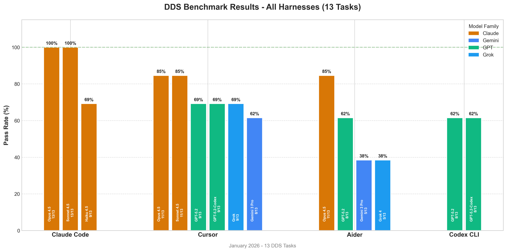
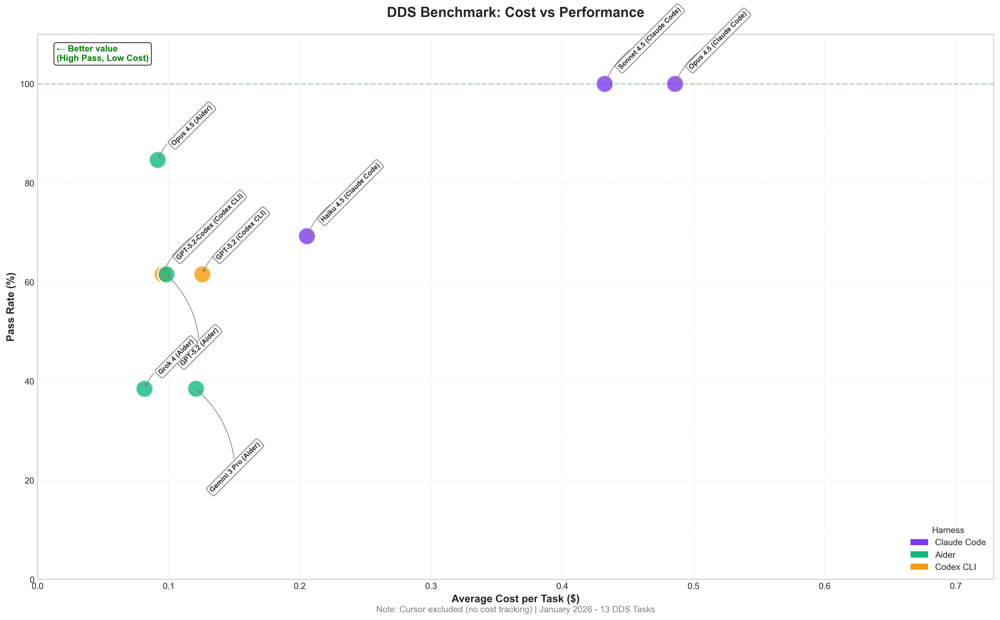

# Harness Bench

A universal benchmarking framework for AI coding assistants.

## Vision

Harness Bench provides a **git-based protocol** for benchmarking any AI coding assistant (Claude Code, OpenAI Codex, Aider, Cursor, etc.) without requiring direct integration with the harness itself.

### Key Principles

1. **Git as the Universal Interface** - All harnesses produce git commits. We evaluate commits, not harness internals.
2. **Decoupled Evaluation** - Harnesses and evaluators are completely independent. Third parties can build harness bridges.
3. **Transparent Protocol** - Clear specification that any harness developer can implement.
4. **Reproducible Results** - Full audit trail via git history.

## Architecture

```
┌─────────────────────────────────────────────────────────────────┐
│                        HARNESS BENCH                             │
├─────────────────────────────────────────────────────────────────┤
│                                                                  │
│  ┌──────────────┐    ┌──────────────┐    ┌──────────────┐       │
│  │ Task Registry│    │  Git Protocol │    │  Evaluator   │       │
│  │              │───▶│   Boundary    │◀───│              │       │
│  │  - Prompts   │    │              │    │  - Verify    │       │
│  │  - Starters  │    │  (commits,   │    │  - Score     │       │
│  │  - Reference │    │   branches)  │    │  - Report    │       │
│  └──────────────┘    └──────────────┘    └──────────────┘       │
│                             ▲                                    │
│                             │                                    │
│         ┌───────────────────┼───────────────────┐               │
│         │                   │                   │               │
│         ▼                   ▼                   ▼               │
│  ┌─────────────┐    ┌─────────────┐    ┌─────────────┐         │
│  │ Claude Code │    │   Aider     │    │   Codex     │         │
│  │   Bridge    │    │   Bridge    │    │   Bridge    │         │
│  └─────────────┘    └─────────────┘    └─────────────┘         │
│                                                                  │
│  (Third-party harness bridges - implement the git protocol)     │
│                                                                  │
└─────────────────────────────────────────────────────────────────┘
```

## How It Works

### 1. Task Setup
```bash
harness-bench task init L1-PY-01 --harness claude-code --run-id abc123
```
Creates a task workspace with:
- Starter files
- Task prompt (in `TASK.md`)
- Harness manifest (`.harness-bench/manifest.json`)

### 2. Harness Execution
The harness (or its bridge) works on the task:
- Reads `TASK.md` for requirements
- Makes commits with conventional format
- Signals completion via final commit or tag

### 3. Evaluation
```bash
harness-bench evaluate ./workspace --task L1-PY-01
```
Evaluator:
- Reads manifest to identify harness
- Analyzes git history (commits, timing, iterations)
- Runs verification against reference implementation
- Produces result JSON

## Documentation

- **[Benchmarking Guide](docs/BENCHMARKING.md)** - How to run benchmarks with different harnesses and models
- **[Protocol Specification](docs/PROTOCOL.md)** - Git-based protocol specification

## Git Protocol Specification

See [docs/PROTOCOL.md](docs/PROTOCOL.md) for the full specification.

### Quick Overview

**Branch Naming:**
```
harness/{harness-id}/{task-id}/{run-id}
```

**Commit Convention:**
```
[harness-bench] {action}: {description}

Harness: {harness-id}
Task: {task-id}
Iteration: {n}
```

**Manifest File (`.harness-bench/manifest.json`):**
```json
{
  "protocol_version": "1.0",
  "harness_id": "claude-code",
  "harness_version": "1.0.0",
  "task_id": "L1-PY-01",
  "run_id": "abc123",
  "started_at": "2026-01-13T10:00:00Z"
}
```

## DDS Benchmark Results (January 2026)

9 RTI Connext DDS tasks (7 Python, 2 C++) testing real-world middleware programming.

### Via Claude Code Harness

| Model | Pass Rate | Cost | Notes |
|-------|-----------|------|-------|
| Claude Opus 4.5 | **9/9 (100%)** | $5.35 | Only config to pass LD-07 |
| Claude Sonnet 4.5 | **9/9 (100%)** | $5.68 | |
| Claude Haiku 4.5 | 7/9 (77.8%) | $2.67 | |

### Via Aider Harness

| Model | Pass Rate | Cost | Notes |
|-------|-----------|------|-------|
| Claude Haiku 4.5 | 8/9 (88.9%) | $0.55 | **Best value** |
| Claude Sonnet 4.0 | 8/9 (88.9%) | $0.97 | |
| Claude Opus 4.5 | 8/9 (88.9%) | $1.19 | |
| Claude Opus 4.0 | 8/9 (88.9%) | $4.86 | |
| Claude Sonnet 4.5 | 7/9 (77.8%) | $1.16 | |
| GPT-5.2-Codex | 6/9 (66.7%) | $1.00 | |

### Via Codex CLI Harness

| Model | Pass Rate | Cost | Notes |
|-------|-----------|------|-------|
| GPT-5.2 | 6/9 (66.7%) | $1.28 | |
| GPT-5.2-Codex | 4/9 (44.4%) | $1.24 | Worse than via Aider |

### Via Cursor Harness

| Model | Pass Rate | Cost | Notes |
|-------|-----------|------|-------|
| Claude Opus 4.5 | 8/9 (88.9%) | N/A | Only LD-07 failed |
| Claude Sonnet 4.5 | 8/9 (88.9%) | N/A | Only LD-07 failed |
| GPT-5.2 | 7/9 (77.8%) | N/A | LD-07, L3-PY-03 failed |
| GPT-5.2-Codex | 7/9 (77.8%) | N/A | LD-07, L3-PY-03 failed |

*Note: Cursor Agent CLI doesn't expose token usage, so costs are not tracked.*

**Key findings:**
- Claude Code harness achieves 100% with Opus/Sonnet 4.5 (only configs to pass LD-07)
- Cursor harness achieves 88.9% with Opus/Sonnet 4.5 (LD-07 remains the hardest task)
- Aider harness is most cost-effective at 88.9% for $0.55 (Haiku 4.5)
- GPT-5.2-Codex performs better via Aider (66.7%) than Codex CLI (44.4%)
- Cursor outperforms Aider/Codex for GPT models (77.8% vs 66.7%)





## Supported Harnesses

| Harness | Status | Bridge |
|---------|--------|--------|
| Claude Code | ✅ Working | Official |
| OpenAI Codex | ✅ Working | Official |
| Aider | ✅ Working | Official |
| Cursor | ✅ Working | Official |
| GitHub Copilot | Planned | Community |

## Installation

```bash
pip install harness-bench
```

## Quick Start

```bash
# Initialize a task for a specific harness
harness-bench task init L1-PY-01 --harness aider

# (Harness works on the task, making commits)

# Evaluate the results
harness-bench evaluate ./L1-PY-01-workspace

# View results
harness-bench report ./results/
```

## License

MIT
